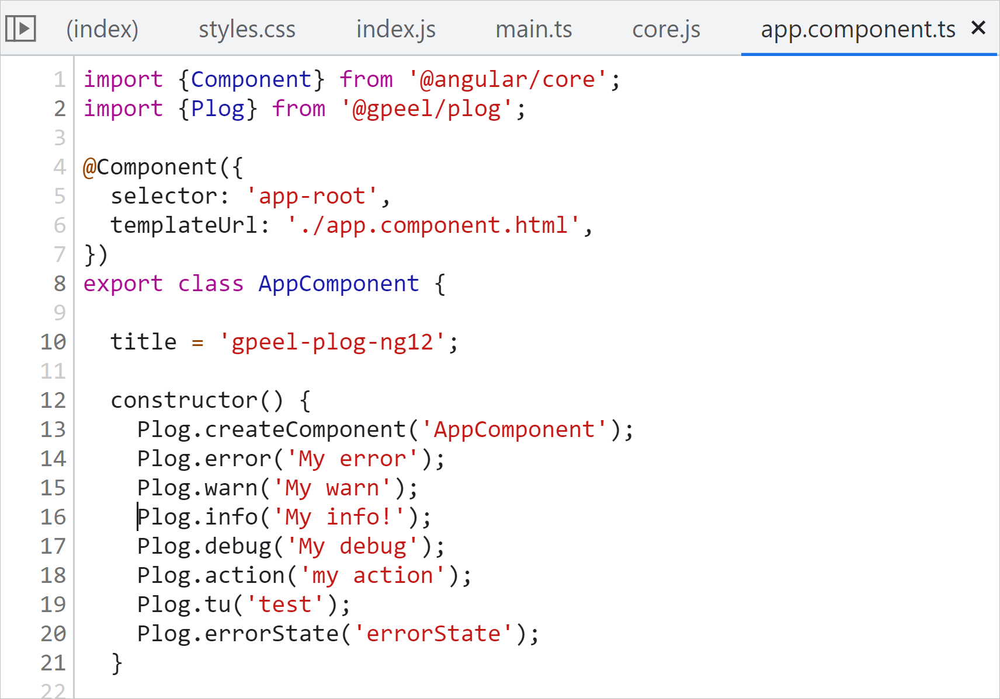

# Colorful logs with @gpeel/plog

This library was generated with [Angular CLI](https://github.com/angular/angular-cli) version 17.0.9

For Angular 16 use @gpeel/plog 16.1.0 or more recent For Angular 12 to 15 => use @gpeel/plog 12.2.0 For Angular
11.x.y => use @gpeel/plog@11.0.1 (last version for angular 11)

npm repo:
https://www.npmjs.com/package/@gpeel/plog

Github repo at :
https://github.com/gpeel/gpeel-plog-ng17


Medium story : https://medium.com/p/62dd10ba3d10/edit

## INSTALLATION

    npm i @gpeel/plog


## Example of what you get


### You get obvious **colors** and also keep the **logs clickable** to navigate to your source code.

To get those style the activated loggers have been defined in a file (for example plog-config.ts) as follow:

````typescript
export const plogConfig: PlogConfig = {

  createComponent: ['color:green;', 'New-@Comp'],

  error: 'color:red; font-size:1rem;',
  warn: 'color:orange',
  info: 'color:blue',
  debug: 'color:limegreen;font-weight:bold',

  action: ['color:#8f72cf; font-weight:bold;', '@ACTION'], // to log inside Action method
  tu: ['color:blue; font-size:1rem;', 'TU'],
  errorState: ['color:#cf3c04', '@ERROR'], // to log error in Store

};
````

And the result is =>



## SETUP for STANDALONE strategy
Your app.config.ts will typically look like this

````typescript
import {providePlog} from '@gpeel/plog';

export const appConfig: ApplicationConfig = {
  providers: [
    providePlog(plogConfig), // this will initialize the logger methods, otherwise no log output done
    provideRouter(routes)
  ]
};

````

## DECLARATION as a MgModule

````typescript
import {PlogModule} from '@gpeel/plog';
import {environment} from '../environments/environment';

@NgModule({
  declarations: [
    AppComponent
  ],
  imports: [
    BrowserModule,
    PlogModule.forRoot(plogConfig) // <<< HERE, takes into account you loggers definition
  ],
  providers: [],
  bootstrap: [AppComponent]
})
export class AppModule {
}
````

## Default loggers definition

For your developpment you typically would activate much more loggers.

You can find an example of ALL available loggers in PLOG_CONFIG_DEFAULT where all loggers  are activated :


````typescript
export const PLOG_CONFIG_DEFAULT = {
  debug: 'color:limegreen',
  info: 'color:blue',
  error: 'color:red',
  warn: 'color:orange',

  // Performance logs
  perf: 'color:darkturquoise',
  perfComponent: ['color:darkturquoise', 'PERF-¤¤'],
  perfCD: ['color:darkturquoise', 'PERF-¤¤¤¤¤¤¤'],
  perfDom: ['color:darkturquoise', 'PERF-¤-¤-¤-¤'],

  // NG hooks
  ngOnChanges: ['color:orange', 'OnChange'],
  ngOnInit: ['color:orange', 'OnInit'],
  ngOnDestroy: ['color:orange', 'OnDestroy'],
  ngDoCheck: ['color:orange', 'DoCheck'],
  ngAfterContentInit: ['color:orange', 'AfterContentInit'],
  ngAfterContentChecked: ['color:orange', 'AfterContentChecked'],
  ngAfterViewInit: ['color:orange', 'AfterViewInit'],
  ngAfterViewChecked: ['color:orange', 'AfterViewChecked'],

  // constructor logs
  create: ['color:green', 'new'],
  createComponent: ['color:green', 'New-@Comp'],
  createDirective: ['color:green', 'New-@Dir'],
  createService: ['color:green', 'New-Svc'],
  createPipe: ['color:green', 'New-@Pipe'],
  createGuard: ['color:green', 'New-@Guard'],
  createResolver: ['color:green', 'New-@Resolver'],

  // NG types
  resolve: ['color:brown', 'RESOLVE'],
  guard: ['color:sandybrown', 'GUARD'],
  validator: 'color:plum',
  pipe: 'color:brown',
  callback: 'color:violet',

  state: 'color:blueviolet', // Redux style or BehaviorSubject, as you want
  // specific logs for NGXS, Akita
  action: ['color:#8f72cf', '@ACTION'], // to log inside Action method
  data: ['color:coral', 'DATA'],
  onAction: ['color:orange', 'ON'], // log for onClick() ... NG event Handlers
  event: ['color:dodgerblue', 'EVENT'],
  select: ['color:#84467c', '@SELECT'], // to log inside select method
  errorState: ['color:#cf3c04', '@ERROR'], // to log error in Store
  effect: ['color:8F72CF', '@EFFECT'], // to log inside effect method (even if using @Effet is not advised)
  cache: ['color:blueviolet', 'CACHE'],

  signal: ['color:blueviolet', 'SIGNALS'],
  siEffect: ['color:blueviolet', 'SIGNALS-EFFECT'],
  siEffectCleanup: ['color:blueviolet', 'SIGNALS-EFFECT-CLEANUP'],
  siSet: ['color:blueviolet', 'SIGNALS-SET'],
  siModif: ['color:blueviolet', 'SIGNALS-MODIF'],
  siUpdate: ['color:blueviolet', 'SIGNALS-UPDATE'],
  siMutate: ['color:blueviolet', 'SIGNALS-MUTATE'],
  siComputed: ['color:blueviolet', 'SIGNALS-COMPUTED'],

  formValueChanges: ['orange', 'FORM-VALUE'],
  formEvent: ['greenyellow', 'FORM-EVENT'],
  streamEvent: ['darkorange', 'STREAM'],
  subscription: ['coral', 'SUBSCRIBED-DATA'],
  unsubscription: ['coral', 'UN-SUBSCRIPTION'],

  // Specific loggers for @gpeel/my-validators
  validationCompute: ['color:orange', '@VALID'], // tracing validators when they compute
  validationErrorMsgRefresh: ['color:orange', '@VALID_PERF'], // tracing refresh of <my-error-msg>
  validationErrorMsgCreation: ['color:orange', '@ERROR_MSG_NEW'], // tracing creation of component <my-error-msg>
  errorMsg: ['color:orange', '@VALID'], // used by <error-msg> deprecated

  // network actions (interceptors)
  network: ['color:blue', 'HTTP'],
  networkRequest: ['color:blue', 'HTTP-Request'],
  networkResponse: ['color:blue', 'HTTP-Response'],
  networkError: ['color:red', 'HTTP-Error'],
  networkCreate: ['color:green', 'NEW-HTTP'],

  httpCall: ['color:springgreen', 'HTTP-CALL'], // http prefix : for service logic
  httpSuccess: ['color:springgreen', 'HTTP-SUCCESS'],
  httpError: ['color:red', 'HTTP-ERROR'],
  httpDebug: ['color:springgreen', 'HTTP-TAP'],

  obsSubscribe: ['color:springgreen', 'OBS-sub'],
  obsSuccess: ['color:springgreen', 'OBS-SUCCESS'],
  obsError: ['color:red', 'OBS-ERROR'],
  obsDebug: ['color:springgreen', 'OBS-DEBUG'],
  obsComplete: ['color:springgreen', 'OBS-COMPLETE'],

  // tests
  tu: ['color:slateblue', 'tu'],
  tuBeforeEach: ['color:slateblue', 'tu-BEFORE-EACH'],
  tuBeforeAll: ['color:slateblue', 'tu-BEFORE-ALL'],
  tuAfterEach: ['color:tomato', 'tu-AFTER-EACH'],
  tuAfterAll: ['color:tomato', 'tu-AFTER-ALL'],
  tuArrange: ['color:blue', 'tu'],
  tuAct: ['color:blueviolet', 'tu'],
  tuAssert: ['color:brown', 'tu'],
  ti: ['color:green', 'ti'],
  te2e: ['color:green', 'e2e'],

  // colors
  pink: ['color:#FF40BD;', '############'], // pink flashy
  red: ['color:red', '############'],
  orange: ['color:orange', '############'],
  green: ['color:springgreen', '############'],
  blue: ['color:cadetblue', '############'],
  lightBlue: ['color:darkturquoise', '############'],
  violet: ['color:blueviolet', '############'],

  // same color-loggers with a prefix 'color' (easier to find with intellisense)
  colorPink: ['color:#FF40BD;', '############'], // pink flashy
  colorRed: 'color:red', // red without the console.error() stacktrace
  colorOrange: ['color:orange', '############'],
  colorGreen: ['color:springgreen', '############'],
  colorBlue: ['color:cadetblue', '############'],
  colorLightBlue: ['color:darkturquoise', '############'],
  colorViolet: ['color:blueviolet', '############'],

  feature1: ['color:blueviolet', 'FEATURE1'],
  feature2: ['color:dodgerblue', 'FEATURE2'],
  feature3: ['color:blue', 'FEATURE3'],
  feature4: ['color:deepskyblue', 'FEATURE4'],
  feature5: ['color:hotpink', 'FEATURE5'],
  feature6: ['color:deeppink', 'FEATURE6'],
  feature7: ['color:mediumspringgreen', 'FEATURE7'],
  feature8: ['color:greenyellow', 'FEATURE8'],
  feature9: ['color:green', 'FEATURE9'],

  step1: ['color:blueviolet', 'STEP1'],
  step2: ['color:dodgerblue', 'STEP2'],
  step3: ['color:blue', 'STEP3'],
  step4: ['color:deepskyblue', 'STEP4'],
  step5: ['color:hotpink', 'STEP5'],
  step6: ['color:deeppink', 'STEP6'],
  step7: ['color:mediumspringgreen', 'STEP7'],
  step8: ['color:greenyellow', 'STEP8'],
  step9: ['color:green', 'STEP9'],

  usecase1: ['color:blueviolet', 'USECASE1'],
  usecase2: ['color:dodgerblue', 'USECASE2'],
  usecase3: ['color:blue', 'USECASE3'],
  usecase4: ['color:deepskyblue', 'USECASE4'],
  usecase5: ['color:hotpink', 'USECASE5'],
  usecase6: ['color:deeppink', 'USECASE6'],
  usecase7: ['color:mediumspringgreen', 'USECASE7'],
  usecase8: ['color:greenyellow', 'USECASE8'],
  usecase9: ['color:green', 'USECASE9'],

  event1: ['color:blueviolet', 'EVENT1'],
  event2: ['color:dodgerblue', 'EVENT2'],
  event3: ['color:blue', 'EVENT3'],
  event4: ['color:deepskyblue', 'EVENT4'],
  event5: ['color:hotpink', 'EVENT5'],
  event6: ['color:deeppink', 'EVENT6'],
  event7: ['color:mediumspringgreen', 'EVENT7'],
  event8: ['color:greenyellow', 'EVENT8'],
  event9: ['color:green', 'EVENT9'],
};

````

To deactivate a logger, simply comment its line.

You can change the CSS (color or anything else), and the prefix.

you can choose the color and the prefix :

        aLogger: [ YourCSS, YourLogPrefix>],

example

        action: ['color:orange', '@ACTION'],

Plog.action("message"); will log

        @ACTION: message

Typescript source codes are delivered inside the installed packge in node_modules/@gpeel/plog/src/lib


